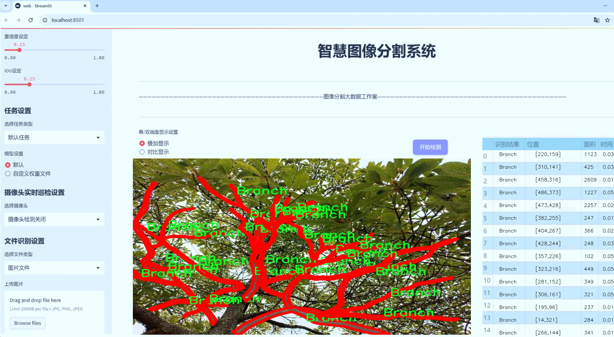
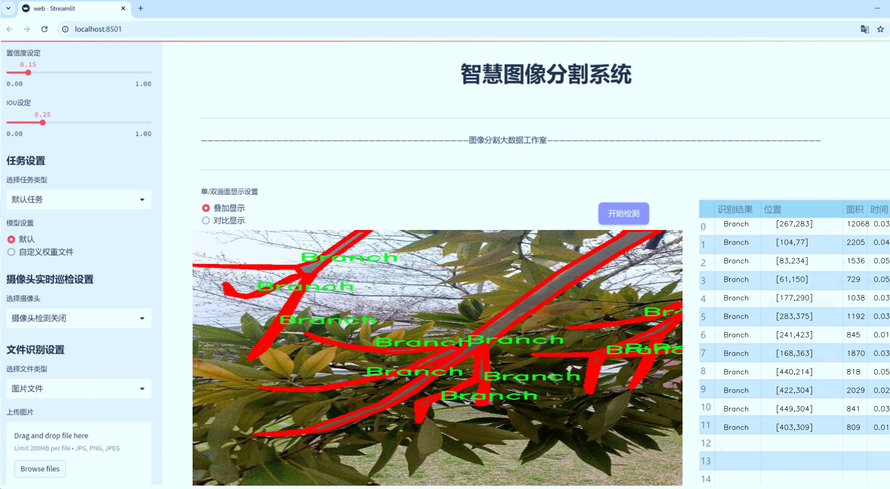
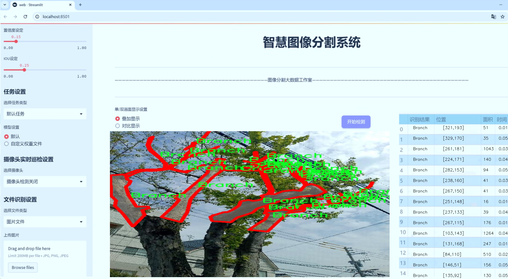
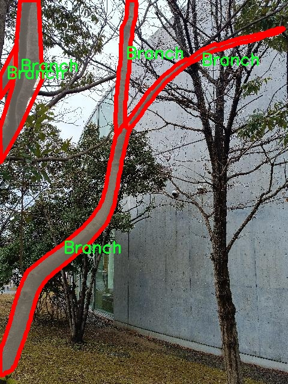
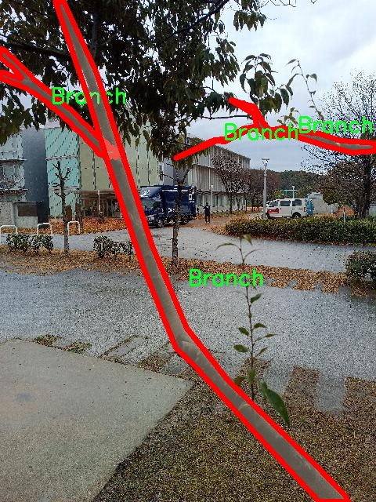
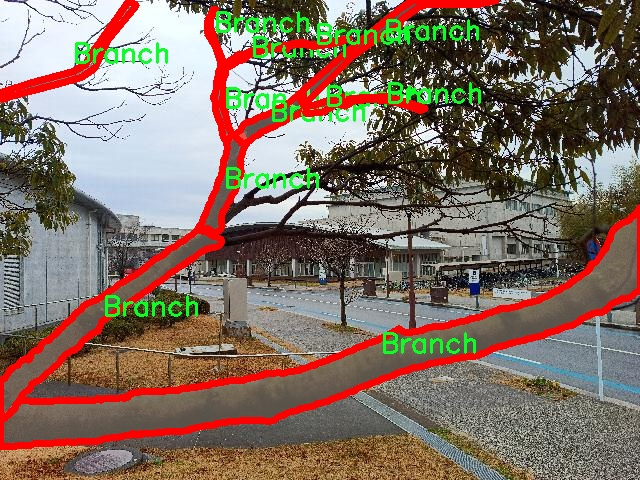
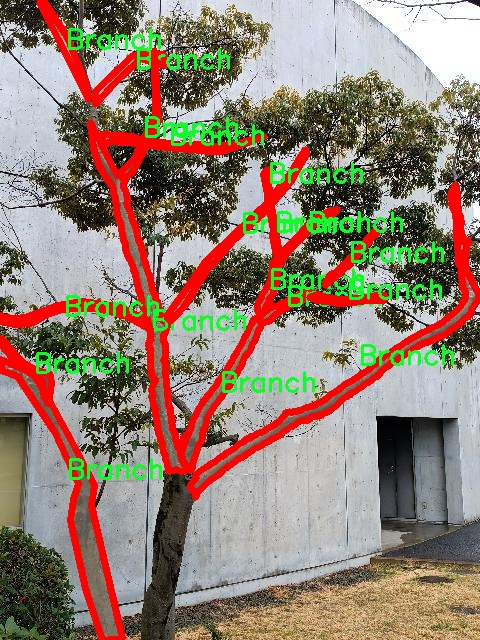
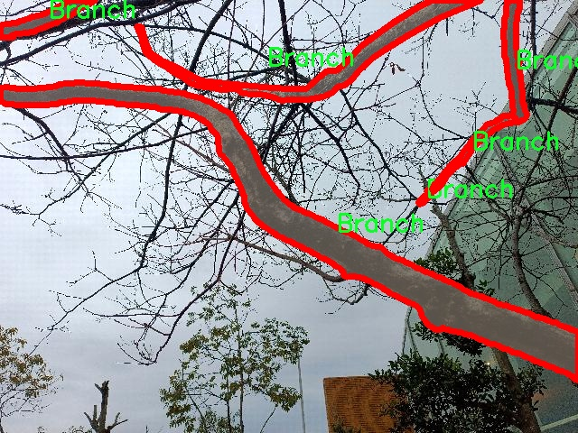

# 树枝图像分割系统： yolov8-seg-LAWDS

### 1.研究背景与意义

[参考博客](https://gitee.com/YOLOv8_YOLOv11_Segmentation_Studio/projects)

[博客来源](https://kdocs.cn/l/cszuIiCKVNis)

研究背景与意义

随着计算机视觉技术的快速发展，图像分割作为其中的重要研究方向，已经在多个领域展现出其广泛的应用潜力。尤其是在农业、林业及生态监测等领域，准确识别和分割植物的不同部分，对于提高生产效率、监测生态环境变化具有重要意义。树枝作为植物的重要组成部分，其生长状态、健康状况及分布特征直接影响到整个生态系统的稳定性。因此，开发一种高效、准确的树枝图像分割系统，能够为相关领域的研究提供有力支持。

近年来，YOLO（You Only Look Once）系列模型因其在目标检测任务中的优越性能而受到广泛关注。YOLOv8作为该系列的最新版本，结合了深度学习和计算机视觉的最新进展，展现出更高的检测精度和更快的处理速度。然而，针对特定领域如树枝图像的分割任务，现有的YOLOv8模型仍存在一定的局限性。为了提升模型在树枝图像分割中的表现，针对性地改进YOLOv8，尤其是在数据集构建和模型训练方面，显得尤为重要。

本研究基于新构建的“new treebranch 3”数据集，旨在通过改进YOLOv8模型，构建一个高效的树枝图像分割系统。该数据集包含2000张树枝图像，涵盖了树枝的多种形态和背景，为模型的训练提供了丰富的样本支持。数据集中仅包含一个类别——树枝，这一单一类别的设计使得模型能够专注于树枝的特征提取和分割，避免了多类别任务中可能出现的干扰因素。

改进YOLOv8的关键在于如何有效地利用这一数据集，通过调整网络结构、优化损失函数以及引入数据增强技术，提升模型在树枝图像分割任务中的表现。此外，研究还将探索不同YOLOv8变体（如yolov8n、yolov8s等）在树枝分割中的适用性，分析其在精度和速度上的权衡，为实际应用提供多样化的选择。

本研究的意义不仅在于提升树枝图像分割的准确性和效率，更在于为植物监测、生态研究等领域提供一种新的技术手段。通过实现高效的树枝分割，研究人员可以更准确地评估树木的生长状况、病虫害影响及环境变化，进而制定相应的管理和保护措施。此外，该系统的成功应用还将为其他植物图像分割任务提供借鉴，推动计算机视觉技术在生态与农业领域的进一步发展。

综上所述，基于改进YOLOv8的树枝图像分割系统的研究，不仅具有重要的理论价值，也具有广泛的实际应用前景。通过对树枝图像的精准分割，能够为生态监测、资源管理及环境保护等领域提供重要的数据支持和决策依据，促进可持续发展目标的实现。

### 2.图片演示







注意：本项目提供完整的训练源码数据集和训练教程,由于此博客编辑较早,暂不提供权重文件（best.pt）,需要按照6.训练教程进行训练后实现上图效果。

### 3.视频演示

[3.1 视频演示](https://www.bilibili.com/video/BV1X1zBYPEcv/)

### 4.数据集信息

##### 4.1 数据集类别数＆类别名

nc: 1
names: ['Branch']


##### 4.2 数据集信息简介

数据集信息展示

在本研究中，我们使用了名为“new treebranch 3”的数据集，旨在训练和改进YOLOv8-seg模型，以实现高效的树枝图像分割。该数据集专注于树枝这一特定类别，提供了丰富的图像样本，旨在为模型的训练提供多样化的输入数据，从而提高分割精度和鲁棒性。

“new treebranch 3”数据集的类别数量为1，唯一的类别名称为“Branch”。这一设计使得数据集在训练过程中能够集中关注树枝的特征，避免了多类别间的干扰，进而提高了模型在树枝分割任务上的表现。尽管类别数量较少，但数据集中的图像样本涵盖了不同环境、光照条件和树枝形态，确保了模型在各种实际应用场景中的适应性。

数据集中的图像经过精心挑选和标注，确保每个样本都能够清晰地展示树枝的形态特征。标注过程采用了严格的标准，确保每个图像中的树枝部分都被准确地分割出来。这种高质量的标注为模型的训练提供了可靠的监督信号，使得YOLOv8-seg能够有效地学习到树枝的边界和形状特征。此外，数据集中还包含了多种不同的背景和环境设置，这些多样性有助于模型在面对不同场景时保持稳定的性能。

在数据集的构建过程中，研究团队还考虑到了数据增强技术的应用。通过对原始图像进行旋转、缩放、裁剪和颜色调整等操作，生成了更多的训练样本。这一策略不仅增加了数据集的规模，还提升了模型的泛化能力，使其能够更好地适应未见过的图像数据。这种数据增强的方式在深度学习模型的训练中已被广泛应用，证明了其有效性。

为了进一步提高模型的性能，我们还计划在数据集的基础上进行细致的分析和评估。通过对模型在不同训练阶段的表现进行监控，我们将能够识别出模型在树枝分割任务中可能存在的不足之处，并据此进行针对性的调整和优化。这种反馈机制将为模型的迭代提供重要依据，确保最终的分割系统能够达到预期的效果。

总之，“new treebranch 3”数据集为我们改进YOLOv8-seg的树枝图像分割系统提供了坚实的基础。通过专注于单一类别的深度学习训练，我们期望能够实现更高的分割精度和更强的模型鲁棒性。随着研究的深入，我们相信这一数据集将为树枝图像分割领域的进一步探索和应用提供重要的支持。











### 5.项目依赖环境部署教程（零基础手把手教学）

[5.1 环境部署教程链接（零基础手把手教学）](https://www.bilibili.com/video/BV1jG4Ve4E9t/?vd_source=bc9aec86d164b67a7004b996143742dc)


[5.2 安装Python虚拟环境创建和依赖库安装视频教程链接（零基础手把手教学）](https://www.bilibili.com/video/BV1nA4VeYEze/?vd_source=bc9aec86d164b67a7004b996143742dc)

### 6.手把手YOLOV8-seg训练视频教程（零基础手把手教学）

[6.1 手把手YOLOV8-seg训练视频教程（零基础小白有手就能学会）](https://www.bilibili.com/video/BV1cA4VeYETe/?vd_source=bc9aec86d164b67a7004b996143742dc)


按照上面的训练视频教程链接加载项目提供的数据集，运行train.py即可开始训练



     Epoch   gpu_mem       box       obj       cls    labels  img_size
     1/200     0G   0.01576   0.01955  0.007536        22      1280: 100%|██████████| 849/849 [14:42<00:00,  1.04s/it]
               Class     Images     Labels          P          R     mAP@.5 mAP@.5:.95: 100%|██████████| 213/213 [01:14<00:00,  2.87it/s]
                 all       3395      17314      0.994      0.957      0.0957      0.0843

     Epoch   gpu_mem       box       obj       cls    labels  img_size
     2/200     0G   0.01578   0.01923  0.007006        22      1280: 100%|██████████| 849/849 [14:44<00:00,  1.04s/it]
               Class     Images     Labels          P          R     mAP@.5 mAP@.5:.95: 100%|██████████| 213/213 [01:12<00:00,  2.95it/s]
                 all       3395      17314      0.996      0.956      0.0957      0.0845

     Epoch   gpu_mem       box       obj       cls    labels  img_size
     3/200     0G   0.01561    0.0191  0.006895        27      1280: 100%|██████████| 849/849 [10:56<00:00,  1.29it/s]
               Class     Images     Labels          P          R     mAP@.5 mAP@.5:.95: 100%|███████   | 187/213 [00:52<00:00,  4.04it/s]
                 all       3395      17314      0.996      0.957      0.0957      0.0845


### 7.50+种全套YOLOV8-seg创新点加载调参实验视频教程（一键加载写好的改进模型的配置文件）

[7.1 50+种全套YOLOV8-seg创新点加载调参实验视频教程（一键加载写好的改进模型的配置文件）](https://www.bilibili.com/video/BV1Hw4VePEXv/?vd_source=bc9aec86d164b67a7004b996143742dc)

### YOLOV8-seg算法简介

原始YOLOV8-seg算法原理

YOLOv8-seg算法是YOLO系列中一个重要的进化版本，旨在解决目标检测和实例分割任务。其核心理念是将高效的目标检测与精确的分割能力结合起来，以适应日益复杂的计算机视觉应用场景。YOLOv8-seg不仅继承了YOLO系列的快速推理特性，还在模型结构和训练策略上进行了多项创新，以提升其在分割任务中的表现。

首先，YOLOv8-seg的网络结构分为三个主要部分：输入端、主干网络和检测端。输入端负责数据的预处理，包括图像的缩放、归一化等操作，以确保输入数据的统一性和有效性。主干网络则是特征提取的核心部分，YOLOv8-seg采用了轻量化的C2f模块替代了之前版本中的C3模块。C2f模块通过引入更多的残差连接和分支结构，增强了特征图中的信息流动，使得网络在保持轻量化的同时，能够提取到更加丰富的特征信息。这种设计使得YOLOv8-seg在处理复杂场景时，能够更好地捕捉到细节信息，从而提高分割精度。

在特征融合方面，YOLOv8-seg继续采用了FPN（特征金字塔网络）和PAN（路径聚合网络）的组合结构。FPN通过自上而下的特征传递，能够有效地融合不同尺度的特征信息，而PAN则通过自下而上的路径聚合，进一步增强了特征的上下文信息。这种多尺度特征融合的策略，使得YOLOv8-seg在面对多样化的目标尺寸时，能够保持较高的检测和分割精度。

检测端的设计是YOLOv8-seg的另一大亮点。与传统的耦合头结构不同，YOLOv8-seg采用了解耦合头结构，将分类和定位任务分开处理。具体而言，网络通过两条并行的分支分别提取类别特征和位置特征，最终通过1×1卷积层完成分类和定位的任务。这种解耦合的设计不仅提高了模型的灵活性，还使得网络在训练过程中能够更好地聚焦于不同任务的特征学习，从而提升了整体性能。

在训练策略上，YOLOv8-seg引入了动态标签分配策略，采用了TOOD（Task-Oriented Object Detection）方法。这一策略旨在解决传统YOLO模型在标签分配过程中可能出现的样本不均衡问题。通过动态调整正负样本的分配，YOLOv8-seg能够更有效地利用训练数据，从而提高模型的收敛速度和最终性能。此外，YOLOv8-seg在损失函数的设计上也进行了优化，使用了变焦损失（Varifocal Loss）来对正负样本进行加权处理，使得模型在训练时能够更加关注高质量的正样本，从而进一步提升分割精度。

值得一提的是，YOLOv8-seg在数据增强方面也进行了创新。除了传统的马赛克增强和混合增强外，YOLOv8-seg还引入了空间扰动和颜色扰动等多种增强手段，以增加训练数据的多样性。这种丰富的数据增强策略，不仅提高了模型的鲁棒性，还有效防止了过拟合现象的发生。

总的来说，YOLOv8-seg算法通过一系列结构和策略上的创新，成功地将目标检测与实例分割的任务结合在一起。其轻量化的设计、有效的特征融合、解耦合的检测头以及动态的标签分配策略，使得YOLOv8-seg在保持高效推理的同时，能够在复杂场景中实现高精度的目标分割。这些创新不仅为YOLO系列的进一步发展奠定了基础，也为计算机视觉领域的实际应用提供了更为强大的工具。随着YOLOv8-seg的不断优化和完善，未来在智能监控、自动驾驶、医疗影像等多个领域，其应用前景将更加广阔。


### 9.系统功能展示（检测对象为举例，实际内容以本项目数据集为准）

图9.1.系统支持检测结果表格显示

  图9.2.系统支持置信度和IOU阈值手动调节

  图9.3.系统支持自定义加载权重文件best.pt(需要你通过步骤5中训练获得)

  图9.4.系统支持摄像头实时识别

  图9.5.系统支持图片识别

  图9.6.系统支持视频识别

  图9.7.系统支持识别结果文件自动保存

  图9.8.系统支持Excel导出检测结果数据


### 10.50+种全套YOLOV8-seg创新点原理讲解（非科班也可以轻松写刊发刊，V11版本正在科研待更新）

#### 10.1 由于篇幅限制，每个创新点的具体原理讲解就不一一展开，具体见下列网址中的创新点对应子项目的技术原理博客网址【Blog】：


[10.1 50+种全套YOLOV8-seg创新点原理讲解链接](https://gitee.com/qunmasj/good)

#### 10.2 部分改进模块原理讲解(完整的改进原理见上图和技术博客链接)【如果此小节的图加载失败可以通过CSDN或者Github搜索该博客的标题访问原始博客，原始博客图片显示正常】
### 全维动态卷积ODConv
鉴于上述讨论，我们的ODConv引入了一种多维注意机制，该机制具有并行策略，用于学习卷积核在核空间的所有四个维度上的不同注意。图提供了CondConv、DyConv和ODConv的示意性比较。

ODConv的公式：根据等式1中的符号，ODConv可定义为


 将注意力标量分配给整个卷积核。图2示出了将这四种类型的关注乘以n个卷积核的过程。原则上，这四种类型的关注是相互补充的，并且以位置、信道、滤波器和核的顺序将它们逐步乘以卷积核 
 ，使得卷积运算不同w.r.t.所有空间位置、所有输入信道、所有滤波器和输入x的所有核，提供捕获丰富上下文线索的性能保证。因此，ODConv可以显著增强CNN基本卷积运算的特征提取能力。此外，具有单个卷积核的ODConv可以与标准CondConv和DyConv竞争或优于它们，为最终模型引入的额外参数大大减少。提供了大量实验来验证这些优点。通过比较等式1和等式2，我们可以清楚地看到，ODConv是一种更广义的动态卷积。此外，当设置n=1且 所有分量均为1时，只关注滤波器方向 的ODConv将减少为：将基于输入特征的SE变量应用于卷积滤波器，然后进行卷积运算（注意原始SE（Hu等人，2018b）基于输出特征，并且用于重新校准输出特征本身）。这种SE变体是ODConv的特例。


图：将ODConv中的四种注意类型逐步乘以卷积核的示例。（a） 沿空间维度的逐位置乘法运算，（b）沿输入信道维度的逐信道乘法运算、（c）沿输出信道维度的按滤波器乘法运算，以及（d）沿卷积核空间的核维度的按核乘法运算。方法部分对符号进行了说明
实现：对于ODConv，一个关键问题是如何计算卷积核的四种关注度 。继CondConv和DyConv之后，我们还使用SE型注意力模块（Hu等人，2018b），但将多个头部作为来计算它们，其结构如图所示。具体而言，首先通过逐通道全局平均池（GAP）运算将输入压缩到具有长度的特征向量中。随后，存在完全连接（FC）层和四个头部分支。ReLU（Krizhevsky等人，2012）位于FC层之后。FC层将压缩特征向量映射到具有缩减比的低维空间（根据消融实验，我们在所有主要实验中设置 ，避免了高模型复杂度）。对于四个头部分支，每个分支都有一个输出大小如图。

### 引入ODConv的改进YOLO
参考这篇博客涵盖了引入ODConv的改进YOLOv8系统的内容，ODConv采用多维注意机制，在卷积核空间的四个维度上学习不同的注意。结合了CondConv和DyConv的优势，ODConv通过图示的四种注意类型逐步与卷积核相乘，以捕获丰富的上下文线索，提升特征提取能力。

#### ODConv结构与方法
ODConv的公式和图示展示了其关注力分配给卷积核的方式，其中四种类型的关注以位置、信道、滤波器和核的顺序逐步与卷积核相乘。这种结构保证了卷积运算不同于标准的Conv操作，能够捕获更多上下文信息，从而增强了CNN的特征提取能力。另外，单个卷积核的ODConv在性能上能够与CondConv和DyConv相竞争，并且引入的额外参数大幅减少。

ODConv的特殊之处在于其广义的动态卷积性质，同时在特定条件下（n=1且所有分量为1），它可以退化为一种特例，即只关注滤波器方向，这类似于基于输入特征的SE变体，但不同于原始SE，它基于输出特征。

#### ODConv的实现
关键问题在于如何计算卷积核的四种关注度。ODConv采用了SE型注意力模块，结合了多个头部来计算这些关注度。具体实现上，通过逐通道全局平均池运算和完全连接层，将输入压缩为特征向量，随后使用四个头部分支来计算四种不同类型的关注。这样的结构能在保持模型复杂度可控的情况下，提升了特征的表征能力。

ODConv的引入为YOLOv8带来了显著的性能提升，并且通过大量实验证明了其在特征提取方面的优越性。其结合了多维注意机制和卷积操作，为目标检测和分拣系统的提升带来了新的思路和性能突破。


### 11.项目核心源码讲解（再也不用担心看不懂代码逻辑）

#### 11.1 ultralytics\utils\metrics.py

以下是对代码中最核心部分的提炼和详细中文注释：

```python
import numpy as np
import torch

def box_iou(box1, box2, eps=1e-7):
    """
    计算两个边界框的交并比（IoU）。
    
    Args:
        box1 (torch.Tensor): 形状为 (N, 4) 的张量，表示 N 个边界框。
        box2 (torch.Tensor): 形状为 (M, 4) 的张量，表示 M 个边界框。
        eps (float, optional): 避免除以零的小值。默认为 1e-7。

    Returns:
        (torch.Tensor): 形状为 (N, M) 的张量，包含 box1 和 box2 中每对边界框的 IoU 值。
    """
    # 将 box1 和 box2 的坐标分解为左上角和右下角的坐标
    (a1, a2), (b1, b2) = box1.unsqueeze(1).chunk(2, 2), box2.unsqueeze(0).chunk(2, 2)
    
    # 计算交集区域
    inter = (torch.min(a2, b2) - torch.max(a1, b1)).clamp_(0).prod(2)

    # 计算 IoU = 交集 / (box1 面积 + box2 面积 - 交集)
    return inter / ((a2 - a1).prod(2) + (b2 - b1).prod(2) - inter + eps)

def bbox_iou(box1, box2, xywh=True, eps=1e-7):
    """
    计算单个边界框与多个边界框之间的交并比（IoU）。
    
    Args:
        box1 (torch.Tensor): 形状为 (1, 4) 的张量，表示单个边界框。
        box2 (torch.Tensor): 形状为 (n, 4) 的张量，表示 n 个边界框。
        xywh (bool, optional): 如果为 True，输入框为 (x, y, w, h) 格式；如果为 False，输入框为 (x1, y1, x2, y2) 格式。默认为 True。
        eps (float, optional): 避免除以零的小值。默认为 1e-7。

    Returns:
        (torch.Tensor): 计算得到的 IoU 值。
    """
    # 将边界框从 (x, y, w, h) 转换为 (x1, y1, x2, y2) 格式
    if xywh:
        (x1, y1, w1, h1), (x2, y2, w2, h2) = box1.chunk(4, -1), box2.chunk(4, -1)
        b1_x1, b1_x2, b1_y1, b1_y2 = x1 - w1 / 2, x1 + w1 / 2, y1 - h1 / 2, y1 + h1 / 2
        b2_x1, b2_x2, b2_y1, b2_y2 = x2 - w2 / 2, x2 + w2 / 2, y2 - h2 / 2, y2 + h2 / 2
    else:
        b1_x1, b1_y1, b1_x2, b1_y2 = box1.chunk(4, -1)
        b2_x1, b2_y1, b2_x2, b2_y2 = box2.chunk(4, -1)

    # 计算交集区域
    inter = (b1_x2.minimum(b2_x2) - b1_x1.maximum(b2_x1)).clamp_(0) * \
            (b1_y2.minimum(b2_y2) - b1_y1.maximum(b2_y1)).clamp_(0)

    # 计算并返回 IoU
    union = (b1_x2 - b1_x1) * (b1_y2 - b1_y1 + eps) + (b2_x2 - b2_x1) * (b2_y2 - b2_y1 + eps) - inter + eps
    return inter / union

def compute_ap(recall, precision):
    """
    计算平均精度（AP），给定召回率和精度曲线。
    
    Args:
        recall (list): 召回率曲线。
        precision (list): 精度曲线。

    Returns:
        (float): 平均精度。
    """
    # 在召回率曲线的开头和结尾添加哨兵值
    mrec = np.concatenate(([0.0], recall, [1.0]))
    mpre = np.concatenate(([1.0], precision, [0.0]))

    # 计算精度包络
    mpre = np.flip(np.maximum.accumulate(np.flip(mpre)))

    # 计算曲线下面积
    ap = np.trapz(np.interp(np.linspace(0, 1, 101), mrec, mpre), np.linspace(0, 1, 101))
    return ap

class Metric:
    """
    计算 YOLOv8 模型的评估指标的类。

    Attributes:
        p (list): 每个类的精度。
        r (list): 每个类的召回率。
        f1 (list): 每个类的 F1 分数。
        all_ap (list): 所有类和所有 IoU 阈值的 AP 分数。
        ap_class_index (list): 每个 AP 分数的类索引。
        nc (int): 类别数量。
    """

    def __init__(self) -> None:
        """初始化 Metric 实例以计算 YOLOv8 模型的评估指标。"""
        self.p = []  # 精度
        self.r = []  # 召回率
        self.f1 = []  # F1 分数
        self.all_ap = []  # AP 分数
        self.ap_class_index = []  # AP 类索引
        self.nc = 0  # 类别数量

    def update(self, results):
        """
        更新模型的评估指标。

        Args:
            results (tuple): 包含评估指标的元组。
        """
        (self.p, self.r, self.f1, self.all_ap, self.ap_class_index) = results

    @property
    def map(self):
        """返回 IoU 阈值从 0.5 到 0.95 的平均 AP。"""
        return self.all_ap.mean() if len(self.all_ap) else 0.0
```

### 核心部分说明：
1. **IoU 计算**：`box_iou` 和 `bbox_iou` 函数用于计算两个边界框之间的交并比（IoU），是目标检测中评估模型性能的重要指标。
2. **平均精度计算**：`compute_ap` 函数计算给定召回率和精度曲线的平均精度（AP），用于评估模型在不同阈值下的表现。
3. **Metric 类**：用于存储和更新模型的评估指标，包括精度、召回率和平均精度等。

这个文件是Ultralytics YOLO项目中的一个模块，主要用于计算模型验证的各种指标。文件中包含了多个函数和类，旨在评估目标检测和分类模型的性能。

首先，文件引入了一些必要的库，包括数学运算、警告处理、路径操作、绘图和深度学习框架PyTorch等。接着，定义了一些常量，比如OKS_SIGMA，用于后续的计算。

接下来，文件中定义了一系列函数来计算不同的指标。`bbox_ioa`函数计算两个边界框之间的交集与第二个框的面积比，`box_iou`函数计算两个框的交并比（IoU），而`bbox_iou`函数则提供了更为复杂的IoU计算，包括GIoU、DIoU、CIoU等多种变体。还有一些函数如`get_inner_iou`和`bbox_inner_iou`用于计算边界框的内部IoU。

文件中还定义了`ConfusionMatrix`类，用于计算和更新混淆矩阵，帮助分析分类和检测任务的性能。这个类包含了处理分类预测和检测结果的方法，能够更新混淆矩阵并提供可视化功能。

此外，文件还包含了多个绘图函数，如`plot_pr_curve`和`plot_mc_curve`，用于绘制精确度-召回率曲线和其他相关的指标曲线。这些函数可以生成图形并保存到指定的目录。

最后，文件定义了多个类，如`Metric`、`DetMetrics`、`SegmentMetrics`、`PoseMetrics`和`ClassifyMetrics`，这些类用于计算和存储不同类型的评估指标。每个类都有其特定的属性和方法，能够处理相应的预测结果，计算平均精度（AP）、精确度、召回率等指标，并提供可视化和输出功能。

总体来说，这个文件是YOLO模型评估的重要组成部分，通过提供多种指标的计算和可视化功能，帮助开发者和研究人员更好地理解和优化他们的目标检测和分类模型。

#### 11.2 ultralytics\models\rtdetr\predict.py

以下是经过简化和注释的核心代码部分：

```python
import torch
from ultralytics.data.augment import LetterBox
from ultralytics.engine.predictor import BasePredictor
from ultralytics.engine.results import Results
from ultralytics.utils import ops

class RTDETRPredictor(BasePredictor):
    """
    RT-DETR预测器，继承自BasePredictor类，用于使用百度的RT-DETR模型进行预测。
    该类利用视觉变换器的强大功能，提供实时物体检测，同时保持高精度。
    """

    def postprocess(self, preds, img, orig_imgs):
        """
        对模型的原始预测结果进行后处理，生成边界框和置信度分数。

        参数:
            preds (torch.Tensor): 模型的原始预测结果。
            img (torch.Tensor): 处理后的输入图像。
            orig_imgs (list or torch.Tensor): 原始未处理的图像。

        返回:
            (list[Results]): 包含后处理边界框、置信度分数和类别标签的Results对象列表。
        """
        # 获取预测结果的维度
        nd = preds[0].shape[-1]
        # 分离边界框和分数
        bboxes, scores = preds[0].split((4, nd - 4), dim=-1)

        # 如果输入图像不是列表，则转换为numpy数组
        if not isinstance(orig_imgs, list):
            orig_imgs = ops.convert_torch2numpy_batch(orig_imgs)

        results = []
        for i, bbox in enumerate(bboxes):  # 遍历每个边界框
            bbox = ops.xywh2xyxy(bbox)  # 将边界框格式从xywh转换为xyxy
            score, cls = scores[i].max(-1, keepdim=True)  # 获取每个边界框的最大分数和对应类别
            idx = score.squeeze(-1) > self.args.conf  # 根据置信度阈值过滤边界框
            # 如果指定了类别，则进一步过滤
            if self.args.classes is not None:
                idx = (cls == torch.tensor(self.args.classes, device=cls.device)).any(1) & idx
            # 合并边界框、分数和类别，并根据idx进行过滤
            pred = torch.cat([bbox, score, cls], dim=-1)[idx]
            orig_img = orig_imgs[i]  # 获取原始图像
            oh, ow = orig_img.shape[:2]  # 获取原始图像的高度和宽度
            # 将边界框坐标从相对坐标转换为原始图像坐标
            pred[..., [0, 2]] *= ow
            pred[..., [1, 3]] *= oh
            img_path = self.batch[0][i]  # 获取图像路径
            # 将结果添加到列表中
            results.append(Results(orig_img, path=img_path, names=self.model.names, boxes=pred))
        return results

    def pre_transform(self, im):
        """
        在将输入图像输入模型进行推理之前，对其进行预处理。
        输入图像被调整为方形比例，并填充到指定大小。

        参数:
            im (list[np.ndarray] | torch.Tensor): 输入图像，形状为(N,3,h,w)的张量或[(h,w,3) x N]的列表。

        返回:
            (list): 预处理后的图像列表，准备进行模型推理。
        """
        letterbox = LetterBox(self.imgsz, auto=False, scaleFill=True)  # 创建LetterBox对象
        return [letterbox(image=x) for x in im]  # 对每个图像进行预处理
```

### 代码说明：
1. **导入模块**：导入必要的库和模块。
2. **RTDETRPredictor类**：该类用于实现RT-DETR模型的预测功能，继承自`BasePredictor`。
3. **postprocess方法**：对模型的预测结果进行后处理，生成最终的边界框和置信度分数，并根据阈值和类别进行过滤。
4. **pre_transform方法**：对输入图像进行预处理，以确保它们符合模型的输入要求，主要是调整图像的大小和比例。

这个程序文件 `ultralytics\models\rtdetr\predict.py` 定义了一个名为 `RTDETRPredictor` 的类，该类继承自 `BasePredictor`，用于实现基于百度的 RT-DETR 模型的实时目标检测。RT-DETR（Real-Time Detection Transformer）结合了视觉变换器的优势，旨在提供高效且准确的目标检测。

在这个类中，首先导入了一些必要的库和模块，包括 PyTorch 和一些用于数据增强、预测和结果处理的工具。类的文档字符串中简要介绍了 RT-DETR 的功能和使用示例，说明了如何通过指定模型和数据源来创建预测器实例，并调用 `predict_cli` 方法进行预测。

类中定义了两个主要的方法：`postprocess` 和 `pre_transform`。

`postprocess` 方法负责对模型的原始预测结果进行后处理，以生成边界框和置信度分数。它首先将预测结果分为边界框和分数，然后根据置信度和类别进行过滤。对于每个边界框，方法将其坐标从中心点宽高格式转换为左上角和右下角格式，并根据置信度阈值和指定的类别进行筛选。最后，将处理后的结果与原始图像结合，创建一个 `Results` 对象列表，包含了边界框、置信度和类别标签。

`pre_transform` 方法则用于在将输入图像送入模型进行推理之前，对其进行预处理。该方法使用 `LetterBox` 类将输入图像调整为正方形，并确保填充比例正确。输入图像可以是一个张量或一个图像列表，返回值是一个经过预处理的图像列表，准备好进行模型推理。

整体而言，这个文件实现了 RT-DETR 模型的预测功能，提供了从图像预处理到结果后处理的完整流程，适用于实时目标检测任务。

#### 11.3 ultralytics\utils\callbacks\neptune.py

以下是代码中最核心的部分，并附上详细的中文注释：

```python
# 导入必要的库
from ultralytics.utils import LOGGER, SETTINGS, TESTS_RUNNING

# 尝试导入neptune库并进行基本的设置检查
try:
    assert not TESTS_RUNNING  # 确保不在测试模式下
    assert SETTINGS['neptune'] is True  # 确保neptune集成已启用
    import neptune
    from neptune.types import File

    assert hasattr(neptune, '__version__')  # 确保neptune库版本存在

    run = None  # 初始化NeptuneAI实验记录实例

except (ImportError, AssertionError):
    neptune = None  # 如果导入失败，则将neptune设置为None


def _log_scalars(scalars, step=0):
    """将标量数据记录到NeptuneAI实验记录器中。"""
    if run:  # 如果Neptune实例已初始化
        for k, v in scalars.items():  # 遍历标量字典
            run[k].append(value=v, step=step)  # 记录标量值和步骤


def _log_images(imgs_dict, group=''):
    """将图像记录到NeptuneAI实验记录器中。"""
    if run:  # 如果Neptune实例已初始化
        for k, v in imgs_dict.items():  # 遍历图像字典
            run[f'{group}/{k}'].upload(File(v))  # 上传图像文件


def on_pretrain_routine_start(trainer):
    """在训练例程开始之前调用的回调函数。"""
    try:
        global run
        # 初始化Neptune运行实例
        run = neptune.init_run(project=trainer.args.project or 'YOLOv8', name=trainer.args.name, tags=['YOLOv8'])
        # 记录超参数配置
        run['Configuration/Hyperparameters'] = {k: '' if v is None else v for k, v in vars(trainer.args).items()}
    except Exception as e:
        LOGGER.warning(f'WARNING ⚠️ NeptuneAI安装但未正确初始化，未记录此运行。 {e}')


def on_train_epoch_end(trainer):
    """每个训练周期结束时调用的回调函数。"""
    _log_scalars(trainer.label_loss_items(trainer.tloss, prefix='train'), trainer.epoch + 1)  # 记录训练损失
    _log_scalars(trainer.lr, trainer.epoch + 1)  # 记录学习率
    if trainer.epoch == 1:  # 如果是第一个周期
        # 记录训练过程中的图像
        _log_images({f.stem: str(f) for f in trainer.save_dir.glob('train_batch*.jpg')}, 'Mosaic')


def on_train_end(trainer):
    """训练结束时调用的回调函数。"""
    if run:  # 如果Neptune实例已初始化
        # 记录最终结果，包括混淆矩阵和PR曲线
        files = [
            'results.png', 'confusion_matrix.png', 'confusion_matrix_normalized.png',
            *(f'{x}_curve.png' for x in ('F1', 'PR', 'P', 'R'))]
        files = [(trainer.save_dir / f) for f in files if (trainer.save_dir / f).exists()]  # 过滤存在的文件
        for f in files:
            _log_plot(title=f.stem, plot_path=f)  # 记录图表
        # 记录最终模型
        run[f'weights/{trainer.args.name or trainer.args.task}/{str(trainer.best.name)}'].upload(File(str(trainer.best)))


# 定义回调函数字典，如果neptune未导入则为空
callbacks = {
    'on_pretrain_routine_start': on_pretrain_routine_start,
    'on_train_epoch_end': on_train_epoch_end,
    'on_fit_epoch_end': on_fit_epoch_end,
    'on_val_end': on_val_end,
    'on_train_end': on_train_end} if neptune else {}
```

### 代码核心部分说明：
1. **Neptune初始化**：代码首先尝试导入Neptune库，并进行基本的设置检查，确保在非测试模式下运行且Neptune集成已启用。
2. **记录标量和图像**：定义了 `_log_scalars` 和 `_log_images` 函数，用于将训练过程中的标量（如损失和学习率）和图像记录到Neptune。
3. **回调函数**：实现了多个回调函数，在训练的不同阶段（如训练开始、每个周期结束、训练结束）记录相关信息。这些信息包括超参数、损失、学习率、图像和最终模型等。

这个程序文件是用于集成NeptuneAI的回调函数，主要用于在训练YOLO模型时记录实验数据。文件首先导入了一些必要的模块和设置，包括日志记录器和配置设置。接着，程序尝试导入Neptune库，并进行一些基本的检查，例如确认Neptune集成是否启用以及Neptune库的版本。

如果导入或检查失败，`neptune`变量将被设置为`None`，这意味着如果Neptune未正确安装或未启用，后续的记录功能将不会执行。

文件中定义了一些私有函数，用于记录不同类型的数据到NeptuneAI实验日志中。`_log_scalars`函数用于记录标量数据，例如损失值和学习率；`_log_images`函数用于记录图像数据；`_log_plot`函数用于记录绘图数据，这些数据通常是训练过程中的可视化结果。

接下来，文件定义了一系列回调函数，这些函数会在训练过程中的特定时刻被调用。例如，`on_pretrain_routine_start`函数在训练开始前被调用，用于初始化Neptune运行并记录超参数配置；`on_train_epoch_end`函数在每个训练周期结束时被调用，记录训练损失和学习率，并在第一个周期结束时记录训练批次的图像；`on_fit_epoch_end`函数在每个训练和验证周期结束时被调用，记录模型的配置信息和指标；`on_val_end`函数在验证结束时被调用，记录验证图像；`on_train_end`函数在训练结束时被调用，记录最终结果和模型权重。

最后，程序将这些回调函数存储在一个字典中，只有在Neptune可用的情况下才会进行存储。这样做的目的是确保在没有Neptune支持的情况下，程序仍然可以正常运行，而不会因缺少某些功能而崩溃。

#### 11.4 ultralytics\utils\files.py

以下是经过简化和注释的核心代码部分：

```python
import os
from pathlib import Path
from datetime import datetime

def increment_path(path, exist_ok=False, sep='', mkdir=False):
    """
    增加文件或目录路径的序号，例如将 'runs/exp' 增加为 'runs/exp_2', 'runs/exp_3' 等。

    参数:
        path (str, pathlib.Path): 要增加的路径。
        exist_ok (bool, optional): 如果为 True，则返回原路径而不增加序号。默认为 False。
        sep (str, optional): 在路径和序号之间使用的分隔符。默认为 ''。
        mkdir (bool, optional): 如果路径不存在，则创建目录。默认为 False。

    返回:
        (pathlib.Path): 增加后的路径。
    """
    path = Path(path)  # 转换为 Path 对象以支持跨平台
    if path.exists() and not exist_ok:
        # 如果路径存在且不允许重复，则增加序号
        path, suffix = (path.with_suffix(''), path.suffix) if path.is_file() else (path, '')

        # 循环查找下一个可用的路径
        for n in range(2, 9999):
            p = f'{path}{sep}{n}{suffix}'  # 增加序号
            if not os.path.exists(p):  # 如果路径不存在，则使用此路径
                break
        path = Path(p)

    if mkdir:
        path.mkdir(parents=True, exist_ok=True)  # 如果需要，创建目录

    return path

def file_age(path):
    """返回文件最后更新距今的天数。"""
    dt = (datetime.now() - datetime.fromtimestamp(Path(path).stat().st_mtime))  # 计算时间差
    return dt.days  # 返回天数

def file_size(path):
    """返回文件或目录的大小（MB）。"""
    if isinstance(path, (str, Path)):
        mb = 1 << 20  # 将字节转换为 MB (1024 ** 2)
        path = Path(path)
        if path.is_file():
            return path.stat().st_size / mb  # 返回文件大小
        elif path.is_dir():
            # 返回目录下所有文件的总大小
            return sum(f.stat().st_size for f in path.glob('**/*') if f.is_file()) / mb
    return 0.0

def get_latest_run(search_dir='.'):
    """返回最近的 'last.pt' 文件路径，通常用于恢复训练。"""
    last_list = glob.glob(f'{search_dir}/**/last*.pt', recursive=True)  # 查找所有匹配的文件
    return max(last_list, key=os.path.getctime) if last_list else ''  # 返回最新的文件路径
```

### 代码注释说明：
1. **increment_path**: 该函数用于生成一个新的文件或目录路径，如果该路径已经存在，可以通过增加序号来避免冲突。可以选择是否创建目录。
2. **file_age**: 该函数计算并返回指定文件自最后修改以来经过的天数。
3. **file_size**: 该函数返回指定文件或目录的大小，单位为MB。对于目录，它会计算所有文件的总大小。
4. **get_latest_run**: 该函数用于查找并返回最近的训练结果文件（通常是`last.pt`），以便进行模型恢复。

这个程序文件 `ultralytics/utils/files.py` 是一个用于处理文件和目录的实用工具类，主要用于在 Ultralytics YOLO 项目中。代码中包含多个功能，以下是对其主要部分的说明。

首先，文件导入了一些必要的模块，包括 `contextlib`、`glob`、`os`、`shutil`、`tempfile`、`datetime` 和 `pathlib`。这些模块提供了文件和目录操作、上下文管理以及时间处理等功能。

`WorkingDirectory` 类是一个上下文管理器，允许用户在指定的工作目录中执行代码。它在实例化时接收一个新的目录路径，并在进入上下文时更改当前工作目录，在退出时恢复到原来的工作目录。这使得在特定目录中运行代码变得更加方便。

`spaces_in_path` 函数是一个上下文管理器，用于处理路径中包含空格的情况。如果路径中有空格，它会将空格替换为下划线，并将文件或目录复制到一个临时路径中执行代码块。执行完毕后，它会将文件或目录复制回原来的位置。这对于某些系统或库在处理路径时可能会出现的问题提供了解决方案。

`increment_path` 函数用于递增文件或目录的路径。如果指定的路径已经存在，并且 `exist_ok` 参数为 `False`，则会在路径后面添加一个数字（如 `runs/exp2`、`runs/exp3` 等），以确保路径的唯一性。该函数还支持创建目录的选项。

`file_age` 函数返回自上次文件更新以来的天数，通过计算当前时间与文件最后修改时间之间的差值来实现。

`file_date` 函数返回文件的最后修改日期，以人类可读的格式（如 '2021-3-26'）表示。

`file_size` 函数用于返回文件或目录的大小（以 MB 为单位）。如果路径是文件，它直接返回文件的大小；如果路径是目录，它会计算目录中所有文件的总大小。

最后，`get_latest_run` 函数用于返回指定目录中最新的 `last.pt` 文件的路径，这通常用于恢复训练或推理的状态。它通过递归搜索指定目录下的所有子目录来找到最新的文件。

整体而言，这个文件提供了一系列便捷的工具函数，旨在简化文件和目录的管理，特别是在处理机器学习模型训练和推理时的文件操作。

#### 11.5 ultralytics\engine\predictor.py

以下是代码中最核心的部分，并附上详细的中文注释：

```python
class BasePredictor:
    """
    BasePredictor类用于创建预测器的基类。

    属性:
        args (SimpleNamespace): 预测器的配置。
        save_dir (Path): 保存结果的目录。
        model (nn.Module): 用于预测的模型。
        device (torch.device): 用于预测的设备。
        dataset (Dataset): 用于预测的数据集。
    """

    def __init__(self, cfg=DEFAULT_CFG, overrides=None, _callbacks=None):
        """
        初始化BasePredictor类。

        参数:
            cfg (str, optional): 配置文件的路径，默认为DEFAULT_CFG。
            overrides (dict, optional): 配置覆盖，默认为None。
        """
        self.args = get_cfg(cfg, overrides)  # 获取配置
        self.save_dir = get_save_dir(self.args)  # 获取保存目录
        self.done_warmup = False  # 是否完成预热
        self.model = None  # 模型初始化为None
        self.device = None  # 设备初始化为None
        self.dataset = None  # 数据集初始化为None
        self.callbacks = _callbacks or callbacks.get_default_callbacks()  # 获取回调函数

    def preprocess(self, im):
        """
        在推理之前准备输入图像。

        参数:
            im (torch.Tensor | List(np.ndarray)): 输入图像，支持张量或列表格式。
        
        返回:
            torch.Tensor: 处理后的图像张量。
        """
        not_tensor = not isinstance(im, torch.Tensor)  # 检查输入是否为张量
        if not_tensor:
            im = np.stack(self.pre_transform(im))  # 预处理图像
            im = im[..., ::-1].transpose((0, 3, 1, 2))  # BGR转RGB，并调整维度
            im = np.ascontiguousarray(im)  # 确保数组是连续的
            im = torch.from_numpy(im)  # 转换为张量

        im = im.to(self.device)  # 将图像移动到指定设备
        im = im.half() if self.model.fp16 else im.float()  # 转换数据类型
        if not_tensor:
            im /= 255  # 将像素值从0-255归一化到0.0-1.0
        return im

    def inference(self, im, *args, **kwargs):
        """对给定图像进行推理。"""
        return self.model(im, augment=self.args.augment)  # 使用模型进行推理

    def stream_inference(self, source=None, model=None, *args, **kwargs):
        """对摄像头实时推理并将结果保存到文件。"""
        if not self.model:
            self.setup_model(model)  # 设置模型

        self.setup_source(source if source is not None else self.args.source)  # 设置数据源

        for batch in self.dataset:  # 遍历数据集
            path, im0s, vid_cap, s = batch  # 获取当前批次的数据
            im = self.preprocess(im0s)  # 预处理图像
            preds = self.inference(im, *args, **kwargs)  # 进行推理
            self.results = self.postprocess(preds, im, im0s)  # 后处理结果

            for i in range(len(im0s)):
                self.write_results(i, self.results, (path[i], im, im0s[i]))  # 写入结果

            yield from self.results  # 生成结果

    def setup_model(self, model, verbose=True):
        """初始化YOLO模型并设置为评估模式。"""
        self.model = AutoBackend(model or self.args.model, device=select_device(self.args.device))  # 初始化模型
        self.device = self.model.device  # 更新设备
        self.model.eval()  # 设置模型为评估模式

    def write_results(self, idx, results, batch):
        """将推理结果写入文件或目录。"""
        p, im, _ = batch  # 获取批次数据
        result = results[idx]  # 获取当前结果
        # 如果需要保存或显示结果，进行处理
        if self.args.save or self.args.show:
            self.plotted_img = result.plot()  # 绘制结果图像
        # 写入文本文件
        if self.args.save_txt:
            result.save_txt(f'{self.save_dir / "labels" / p.stem}.txt')
```

### 代码说明
1. **BasePredictor类**: 这是一个用于创建YOLO模型预测器的基类，包含初始化、预处理、推理、流式推理等方法。
2. **__init__方法**: 初始化类的属性，包括配置、保存目录、模型、设备等。
3. **preprocess方法**: 处理输入图像，确保其格式适合模型输入。
4. **inference方法**: 使用模型对处理后的图像进行推理。
5. **stream_inference方法**: 实时处理摄像头输入，进行推理并保存结果。
6. **setup_model方法**: 初始化YOLO模型并设置为评估模式。
7. **write_results方法**: 将推理结果写入文件或进行可视化。

通过这些核心部分，BasePredictor类能够实现对图像、视频等多种输入源的推理和结果处理。

这个程序文件是Ultralytics YOLO（You Only Look Once）模型的预测器实现，主要用于在图像、视频、网络摄像头等多种来源上进行目标检测。文件的开头部分包含了使用说明，列出了支持的输入源和模型格式，方便用户了解如何使用该程序。

在代码中，`BasePredictor`类是预测器的基础类，负责设置和执行模型的推理过程。构造函数`__init__`中，程序会根据提供的配置文件初始化一些属性，包括保存结果的目录、模型、数据配置等。`preprocess`方法用于对输入图像进行预处理，确保其符合模型的输入要求。该方法会将图像转换为张量格式，并进行必要的归一化处理。

`inference`方法则是执行推理的核心，调用模型对预处理后的图像进行预测。`postprocess`方法用于对模型的输出结果进行后处理，准备最终的预测结果。

`__call__`方法允许对象像函数一样被调用，执行推理操作。`stream_inference`方法则实现了实时推理的功能，能够处理来自摄像头或视频流的输入，并在每一帧上执行目标检测。

程序中还包括了许多辅助方法，例如`setup_source`用于设置输入源，`write_results`用于将推理结果写入文件，`show`用于在窗口中显示图像，`save_preds`用于保存预测结果到视频文件中。通过这些方法，程序能够高效地处理不同类型的输入，并将结果以可视化的方式呈现。

此外，程序还实现了回调机制，允许用户在特定事件发生时执行自定义函数，增强了程序的灵活性和可扩展性。总的来说，这个文件是一个功能强大的目标检测预测器，能够处理多种输入源，并提供丰富的结果输出选项。

### 12.系统整体结构（节选）

### 程序整体功能和构架概括

Ultralytics YOLO项目是一个用于目标检测的深度学习框架，旨在提供高效、准确的模型训练和推理功能。该项目的整体架构由多个模块组成，每个模块负责特定的功能，以实现从数据处理、模型训练到结果评估和预测的完整流程。

- **数据处理与预处理**：通过 `ultralytics/utils/files.py` 和 `ultralytics/models/rtdetr/predict.py`，实现了输入数据的预处理和文件管理，确保数据格式符合模型要求。
- **模型预测**：`ultralytics/engine/predictor.py` 提供了模型推理的核心功能，支持多种输入源（如图像、视频、摄像头）并能够实时执行目标检测。
- **性能评估**：`ultralytics/utils/metrics.py` 负责计算和记录模型的各种性能指标，帮助开发者分析模型的表现。
- **回调与日志记录**：`ultralytics/utils/callbacks/neptune.py` 集成了NeptuneAI，用于记录训练过程中的实验数据，方便用户进行实验管理和结果可视化。

通过这些模块的协同工作，Ultralytics YOLO项目能够高效地进行目标检测任务，从数据输入到结果输出，提供了一整套解决方案。

### 文件功能整理表

| 文件路径                                   | 功能描述                                                                                      |
|--------------------------------------------|-----------------------------------------------------------------------------------------------|
| `ultralytics/utils/metrics.py`            | 计算和记录模型的性能指标，包括IoU、混淆矩阵、精确度、召回率等，并提供可视化功能。                  |
| `ultralytics/models/rtdetr/predict.py`    | 实现RT-DETR模型的预测功能，包括图像预处理、模型推理和结果后处理，支持多种输入源。               |
| `ultralytics/utils/callbacks/neptune.py`  | 集成NeptuneAI进行实验数据记录，支持训练过程中的超参数、损失和图像等信息的记录和可视化。       |
| `ultralytics/utils/files.py`              | 提供文件和目录管理的实用工具，包括路径处理、文件大小计算、增量路径生成等功能。                  |
| `ultralytics/engine/predictor.py`         | 负责模型的推理过程，支持实时目标检测，处理多种输入源，并提供结果的可视化和保存功能。           |

这个表格清晰地总结了每个文件的主要功能，便于理解Ultralytics YOLO项目的整体架构和各个模块之间的关系。

### 13.图片、视频、摄像头图像分割Demo(去除WebUI)代码

在这个博客小节中，我们将讨论如何在不使用WebUI的情况下，实现图像分割模型的使用。本项目代码已经优化整合，方便用户将分割功能嵌入自己的项目中。
核心功能包括图片、视频、摄像头图像的分割，ROI区域的轮廓提取、类别分类、周长计算、面积计算、圆度计算以及颜色提取等。
这些功能提供了良好的二次开发基础。

### 核心代码解读

以下是主要代码片段，我们会为每一块代码进行详细的批注解释：

```python
import random
import cv2
import numpy as np
from PIL import ImageFont, ImageDraw, Image
from hashlib import md5
from model import Web_Detector
from chinese_name_list import Label_list

# 根据名称生成颜色
def generate_color_based_on_name(name):
    ......

# 计算多边形面积
def calculate_polygon_area(points):
    return cv2.contourArea(points.astype(np.float32))

...
# 绘制中文标签
def draw_with_chinese(image, text, position, font_size=20, color=(255, 0, 0)):
    image_pil = Image.fromarray(cv2.cvtColor(image, cv2.COLOR_BGR2RGB))
    draw = ImageDraw.Draw(image_pil)
    font = ImageFont.truetype("simsun.ttc", font_size, encoding="unic")
    draw.text(position, text, font=font, fill=color)
    return cv2.cvtColor(np.array(image_pil), cv2.COLOR_RGB2BGR)

# 动态调整参数
def adjust_parameter(image_size, base_size=1000):
    max_size = max(image_size)
    return max_size / base_size

# 绘制检测结果
def draw_detections(image, info, alpha=0.2):
    name, bbox, conf, cls_id, mask = info['class_name'], info['bbox'], info['score'], info['class_id'], info['mask']
    adjust_param = adjust_parameter(image.shape[:2])
    spacing = int(20 * adjust_param)

    if mask is None:
        x1, y1, x2, y2 = bbox
        aim_frame_area = (x2 - x1) * (y2 - y1)
        cv2.rectangle(image, (x1, y1), (x2, y2), color=(0, 0, 255), thickness=int(3 * adjust_param))
        image = draw_with_chinese(image, name, (x1, y1 - int(30 * adjust_param)), font_size=int(35 * adjust_param))
        y_offset = int(50 * adjust_param)  # 类别名称上方绘制，其下方留出空间
    else:
        mask_points = np.concatenate(mask)
        aim_frame_area = calculate_polygon_area(mask_points)
        mask_color = generate_color_based_on_name(name)
        try:
            overlay = image.copy()
            cv2.fillPoly(overlay, [mask_points.astype(np.int32)], mask_color)
            image = cv2.addWeighted(overlay, 0.3, image, 0.7, 0)
            cv2.drawContours(image, [mask_points.astype(np.int32)], -1, (0, 0, 255), thickness=int(8 * adjust_param))

            # 计算面积、周长、圆度
            area = cv2.contourArea(mask_points.astype(np.int32))
            perimeter = cv2.arcLength(mask_points.astype(np.int32), True)
            ......

            # 计算色彩
            mask = np.zeros(image.shape[:2], dtype=np.uint8)
            cv2.drawContours(mask, [mask_points.astype(np.int32)], -1, 255, -1)
            color_points = cv2.findNonZero(mask)
            ......

            # 绘制类别名称
            x, y = np.min(mask_points, axis=0).astype(int)
            image = draw_with_chinese(image, name, (x, y - int(30 * adjust_param)), font_size=int(35 * adjust_param))
            y_offset = int(50 * adjust_param)

            # 绘制面积、周长、圆度和色彩值
            metrics = [("Area", area), ("Perimeter", perimeter), ("Circularity", circularity), ("Color", color_str)]
            for idx, (metric_name, metric_value) in enumerate(metrics):
                ......

    return image, aim_frame_area

# 处理每帧图像
def process_frame(model, image):
    pre_img = model.preprocess(image)
    pred = model.predict(pre_img)
    det = pred[0] if det is not None and len(det)
    if det:
        det_info = model.postprocess(pred)
        for info in det_info:
            image, _ = draw_detections(image, info)
    return image

if __name__ == "__main__":
    cls_name = Label_list
    model = Web_Detector()
    model.load_model("./weights/yolov8s-seg.pt")

    # 摄像头实时处理
    cap = cv2.VideoCapture(0)
    while cap.isOpened():
        ret, frame = cap.read()
        if not ret:
            break
        ......

    # 图片处理
    image_path = './icon/OIP.jpg'
    image = cv2.imread(image_path)
    if image is not None:
        processed_image = process_frame(model, image)
        ......

    # 视频处理
    video_path = ''  # 输入视频的路径
    cap = cv2.VideoCapture(video_path)
    while cap.isOpened():
        ret, frame = cap.read()
        ......
```


### 14.完整训练+Web前端界面+50+种创新点源码、数据集获取


# [下载链接：https://mbd.pub/o/bread/Z5yUl5tv](https://mbd.pub/o/bread/Z5yUl5tv)